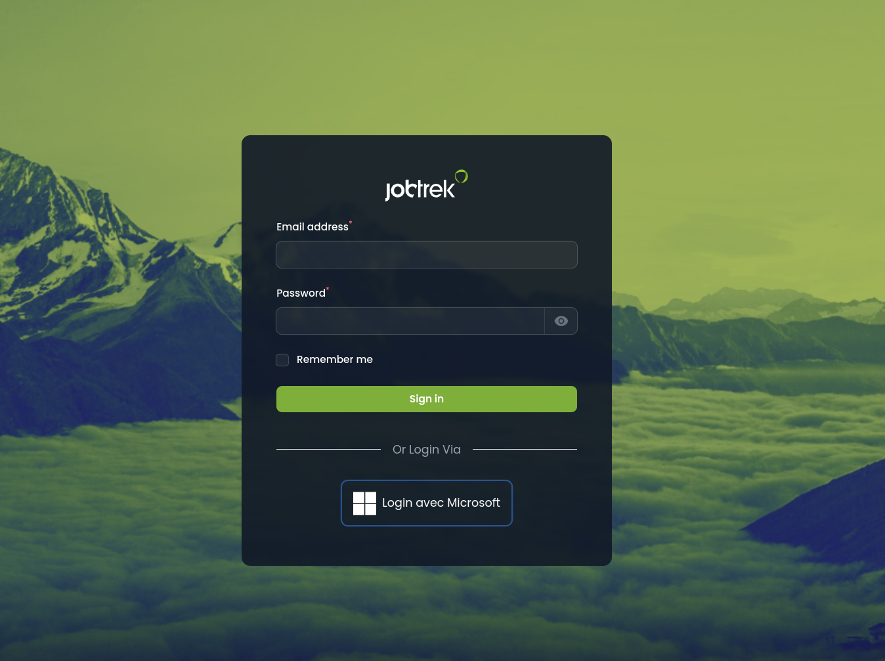
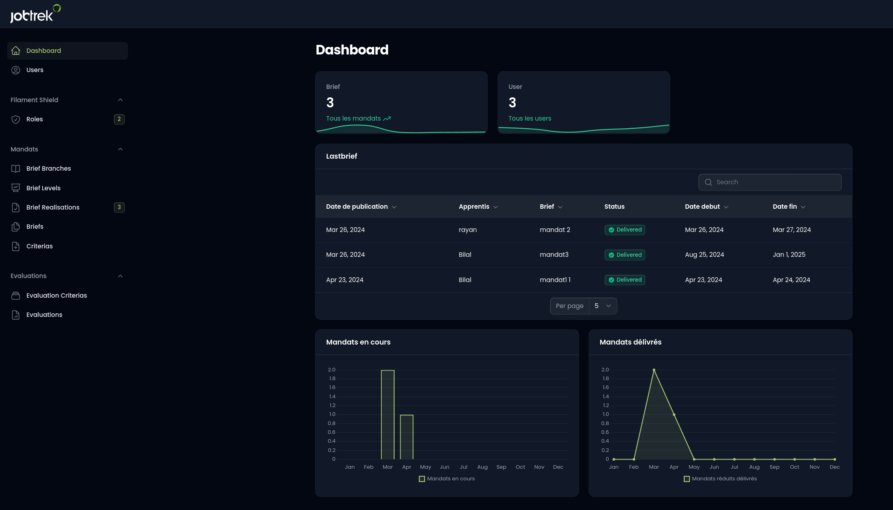

# Application de Gestion d'Évaluation pour Apprentis Employés de Commerce (CFC)

## Introduction

L'application de gestion d'évaluation pour les apprentis employés de commerce (CFC) vise à fournir un outil complet et convivial aux formateurs pour évaluer et suivre les progrès des apprentis tout au long de leur formation. Conçue pour répondre aux besoins spécifiques des formateurs et des apprentis dans le domaine du commerce, cette application permettra de centraliser les informations liées aux mandats, aux évaluations et aux commentaires, facilitant ainsi le processus d'évaluation et de suivi.

## Fonctionnalités Principales

Dans cette section, nous allons explorer en détail les principales fonctionnalités de notre application de gestion d'évaluation pour les apprentis employés de commerce (CFC), en mettant en évidence l'utilisation de Laravel Filament, Docker et PostgreSQL pour leur implémentation.

### 1. Tableau de Bord (Dashboard) :
   - Utilisation de Laravel Filament pour créer une interface utilisateur conviviale et intuitive.
   - Affichage des données importantes telles que les apprentis en cours, les mandats actifs, les prochains mandats, etc.
   - Intégration de Docker pour la gestion de l'environnement de développement et de déploiement de l'application.

### 2. Gestion des Mandats :
   - Création, édition et suppression des mandats à l'aide de Laravel Filament.
   - Stockage des informations sur les mandats, y compris l'année, dans une base de données PostgreSQL.
   - Utilisation des migrations Laravel pour gérer la structure de la base de données.

### 3. Assignation des Mandats aux Apprentis :
   - Implémentation d'une fonctionnalité permettant d'assigner des mandats spécifiques à des apprentis.
   - Utilisation de relations Eloquent dans Laravel pour gérer les assignations entre apprentis et mandats.

### 4. Gestion des Apprentis :
   - Création d'une page dédiée aux apprentis, affichant des informations telles que le nom, le prénom, les mandats réalisés et non réalisés, etc.
   - Utilisation de Laravel Filament pour créer des vues dynamiques et interactives pour la gestion des apprentis.

### 5. Évaluation des Apprentis :
   - Développement d'une interface permettant aux formateurs d'évaluer les apprentis pour chaque mandat.
   - Utilisation de formulaires interactifs dans Laravel Filament pour saisir les critères d'évaluation et les notes attribuées.

### 6. Calcul des Moyennes et Commentaires :
   - Calcul automatique de la moyenne des notes attribuées à chaque apprenti pour chaque mandat.
   - Intégration de fonctionnalités permettant aux formateurs d'ajouter des commentaires spécifiques à chaque critère d'évaluation et un commentaire général pour chaque apprenti.

### 7. Consultation des Évaluations et Notes :
   - Mise en place d'une fonctionnalité permettant aux formateurs de consulter toutes les évaluations qu'ils ont réalisées.
   - Affichage des commentaires généraux et des notes moyennes pour chaque apprenti, avec un calcul du pourcentage de points obtenus par rapport au total.

## Login Microsoft

Mon application offre une connexion sécurisée via Microsoft 365 Azure, simplifiant ainsi l'accès des formateurs. En utilisant leurs identifiants Microsoft, les formateurs peuvent se connecter facilement et rapidement, sans avoir à créer de nouveaux comptes.

### Accès aux Fonctionnalités Avancées

Une fois connectés, les formateurs peuvent accéder à un tableau de bord intuitif où ils peuvent visualiser les informations essentielles telles que les apprentis en cours, les mandats actifs et les évaluations en attente. De plus, ils peuvent utiliser des fonctionnalités avancées telles que l'évaluation des apprentis, la gestion des mandats et la consultation des évaluations précédentes

